# Enterprise AI Guard

**A Zero-Trust Data Leak Prevention (DLP) Platform for Corporate AI Usage**

Enterprise AI Guard is a comprehensive security platform designed to protect corporate assets from being accidentally or maliciously leaked to public Generative AI platforms like ChatGPT, Claude, and Gemini. 

Rather than relying on network-level proxies which break end-to-end encryption, this project utilizes a client-side Chrome Extension paired with a centralized FastAPI backend to analyze, sanitize, and block sensitive employee prompts in real-time—right inside the browser.

---

## Key Features
- **Real-Time DOM Interception:** Safely intercepts React submit events on modern AI chat apps without breaking the UI.
- **Three-Tier Detection Engine:** Combines NLP, Regex, and Proximity matching to catch semantic PII, strict credentials, and conversational secrets.
- **Zero-Trust Architecture:** Runs entirely locally via an embedded SQLite DB and Python backend; no corporate data is ever sent to third-party cloud analyzers.
- **CISO Admin Dashboard:** Centralized command center to monitor live audit logs, view threat analytics, and deploy global security rules instantly.
- **Auto-Sanitization:** Automatically masks sensitive data (e.g., `<REDACTED>`) allowing employees to continue working securely.

---

## Architecture & Data Flow

The platform is split into the Client Shield (Chrome Extension) and the Command Center (FastAPI Backend).

```mermaid
sequenceDiagram
    autonumber
    participant User as Employee
    participant Extension as Chrome Extension
    participant API as FastAPI Backend
    participant Engine as Detection Engine
    participant DB as SQLite DB

    User->>Extension: Types prompt into ChatGPT
    Note over Extension: Waits 600ms (Debounce)
    
    Extension->>API: Sends prompt string (POST /api/scan)
    API->>Engine: Forwards text for analysis
    
    rect rgb(30, 30, 30)
        Note over Engine: Phase 1: Custom Proximity Matching
        Note over Engine: Phase 2: Static Regex Rules
        Note over Engine: Phase 3: Semantic NLP (Presidio)
    end
    
    Engine-->>API: Returns Risk Score & Sanitized Text
    
    API->>DB: Saves audit log (Score, Violations, Original Text)
    
    API-->>Extension: Returns decision (ALLOW, WARN, or BLOCK)
    
    alt Score is ALLOW (0-24)
        Extension->>User: Steps aside and allows native ChatGPT submission
    else Score is WARN or BLOCK (25-100)
        Extension->>User: Halts the send event and shows Security UI Modal
    end
```



### The 3 Phases of Detection
1. **Custom Proximity Engine:** Uses Anchor-Value logic. If a CISO defines anchor words like `api` or `password`, the engine searches for those words within 20 characters of a high-entropy string (catching conversational leaks like *"my api key is sk-12345"*).
2. **Static Signature Rules:** Uses strict mathematical RegEx patterns to instantly identify standard secrets (AWS Keys, RSA Private Keys, Credit Cards) regardless of the surrounding text.
3. **Semantic NLP:** Uses Artificial Intelligence (**Microsoft Presidio / spaCy**) to actually *read* the context of the sentence, dynamically identifying Personally Identifiable Information (PII) such as Names, Locations, and Organizations.

---

## Tech Stack
* **Backend:** Python 3.10+, FastAPI, Uvicorn
* **Database:** SQLite3 (Embedded, serverless)
* **Security & NLP:** Microsoft Presidio Analyzer, spaCy (`en_core_web_sm`), Python `re`
* **Browser Extension:** Chrome Manifest V3, Vanilla JS, CSS
* **Web Dashboard:** HTML5, Tailwind CSS, Chart.js

---

## Getting Started

### 1. Run the Backend
```bash
# Clone the repository
git clone https://github.com/yourusername/enterprise-ai-guard.git
cd enterprise-ai-guard

# Create and activate a virtual environment
python -m venv venv
source venv/bin/activate  # On Windows use: .\venv\Scripts\activate

# Install dependencies
pip install -r requirements.txt

# Seed the initial database with default rules
python seed.py
python seed_keywords.py

# Start the FastAPI server
uvicorn main:app --reload --host 127.0.0.1 --port 8000
```
*You can now access the Admin Dashboard at `http://127.0.0.1:8000`*

### 2. Install the Chrome Extension
1. Open Google Chrome and navigate to `chrome://extensions/`
2. Enable **Developer mode** in the top right corner.
3. Click **Load unpacked**.
4. Select the `extension` folder located inside this repository.
5. Pin the extension to your toolbar and ensure the switch is set to "Active Engine".

---

## How to Test
1. Open [ChatGPT](https://chatgpt.com/).
2. Type a safe query: `Draft an executive summary of our Q3 marketing deliverables.` (Notice it passes seamlessly).
3. Type a PII leak: `My name is John Smith and my email is alice@corp.com.` (Notice the WARN block).
4. Type a critical leak: `Here is the server password: sk-live-9381283948293849.` (Notice the instant BLOCK).
5. Open your Admin Dashboard at `http://127.0.0.1:8000` to view the intercepted audit logs!
